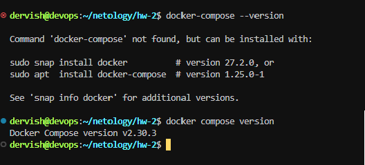
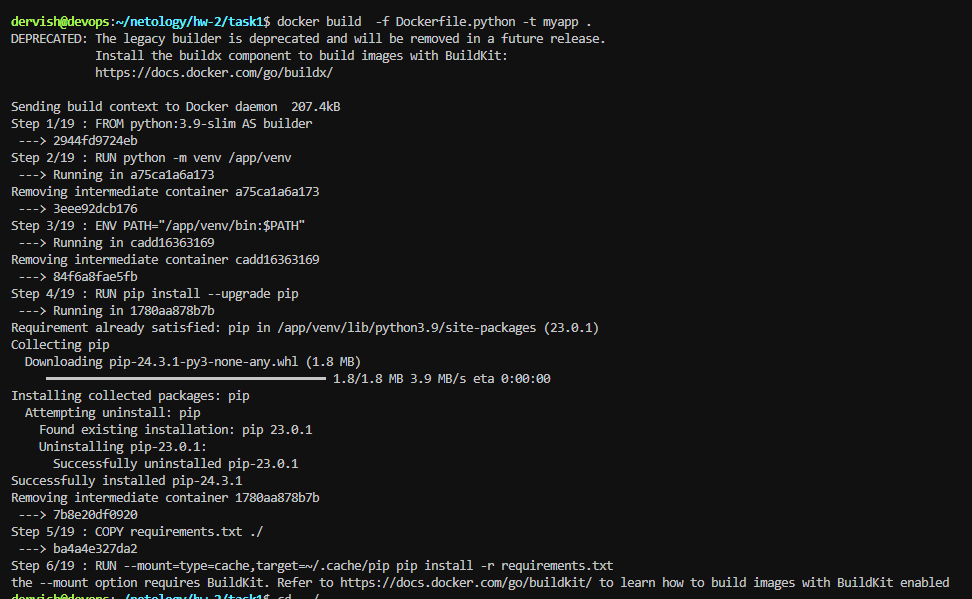
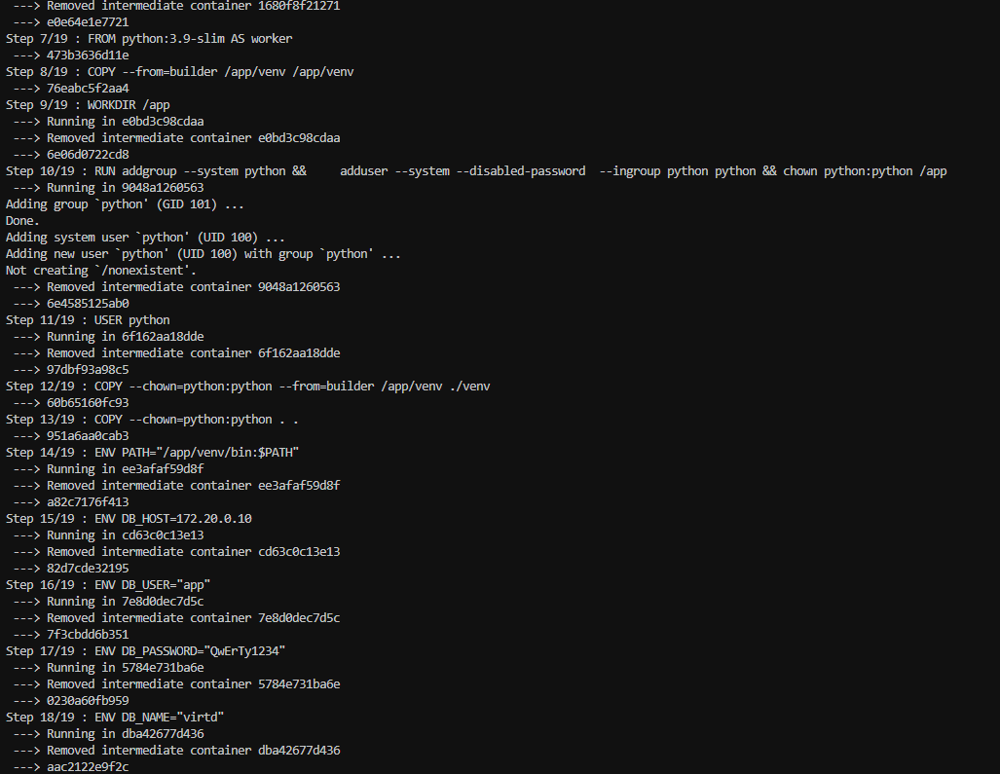
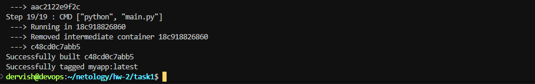
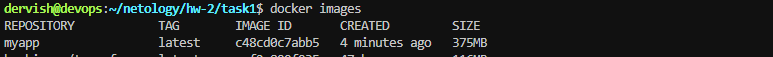
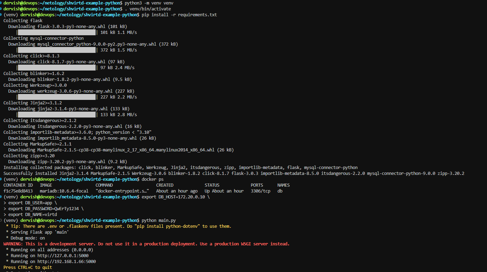
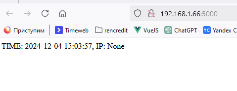

## Задача 0

Убедимся, что у нас установлено нужное ПО.

## Задача 1

[Создаем fork репозитория](https://github.com/ua4wne/shvirtd-example-python.git)

Создали файл с именем Dockerfile.python для сборки данного проекта и проверяем корректность сборки.

Запускаем web-приложение без использования docker в venv. (Mysql БД запускаем в контейнере docker).

## Задача 3

