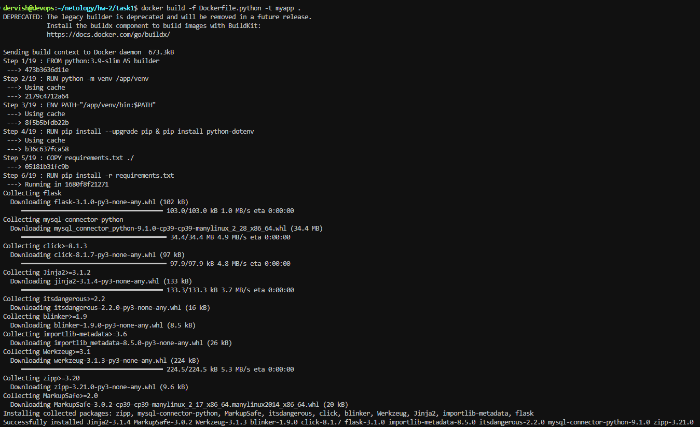
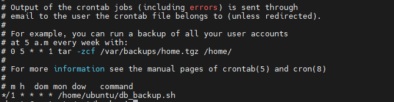

## Задача 0

Убедимся, что у нас установлено нужное ПО.

## Задача 1

Создаем [fork репозитория](https://github.com/ua4wne/shvirtd-example-python.git)

Создали файл с именем Dockerfile.python для сборки данного проекта и проверяем корректность сборки.

Запускаем web-приложение без использования docker в venv. (Mysql БД запускаем в контейнере docker).

Исправление для управления названием используемой таблицы через ENV переменную, которую добавляем в Dockerfile.python (ENV DB_TABLE="requests")

## Задача 2

Создали в yandex cloud container registry с именем "test" с помощью "yc tool" (при выполнении команды не поправил имя на test, изменил его потом через веб-интерфейс)

после загрузки образа выполняем его сканирование

видно, что образ содержит одну критическую уязвимость и несколько уязвимостей уровня HIGH и MEDIUM

## Задача 3

Создаем файл для запуска нескольких контейнеров для работы приложения и запускаем  его в работу при помощи команды docker compose up -d

Теперь подключимся к БД и посмотрим, что там есть

## Задача 4

Создаем ВМ в Yandex Cloud и устанавливаем необходимое ПО, далее при помощи скрипта deploy.sh запускаем проект на этой ВМ и проверяем работу приложения

Настраиваем remote ssh context к нашему серверу

Теперь подключимся к БД и посмотрим, что там есть

## Задача 5

Настроим резервное копирование при помощи образа schnitzler/mysqldump. Чтобы не светить секреты в репозиторий, предварительно на хосте создадим необходимые переменные окружения

`export DB_HOST=172.20.0.10 
export DB_USER=app 
export DB_PASSWORD=pass
export DB_NAME=virtd`

Далее напишем скрипт для кронтаба db_backup.sh, в который поместим следующую команду
`/usr/bin/docker run --rm --entrypoint "" -v /opt/backup:/backup --network="shvirtd-example-python_backend" --link="db:db" schnitzler/mysqldump mysqldump --opt -h db -u$DB_USER -p$DB_PASSWORD "--result-file=/backup/$(date +%F--%H-%M-%S)-dumps.sql" $DB_NAME`

Сам кронтаб

Результат работы задания по архивации

